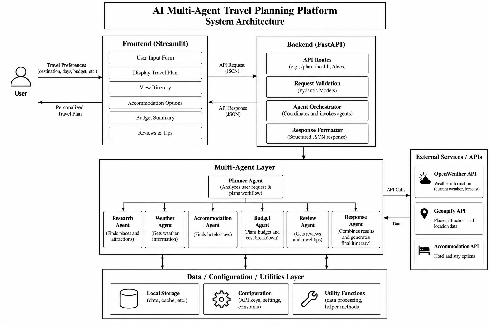

# TravelAI — AI Multi-Agent Travel Planner

An AI-powered travel planning application built on a **multi-agent architecture**. A FastAPI backend orchestrates eight specialized agents (planning, research, transportation, accommodation, budgeting, itinerary building, review, and final response generation), backed by Groq's LLM API, with a vanilla HTML/CSS/JS frontend.

##  Features

- **Dynamic multi-agent orchestration** — a Planner Agent analyzes the user's request and generates a step-by-step execution plan (with dependencies) that the Orchestrator executes agent-by-agent.
- **Shared memory** between agents so each agent can access the outputs of previous steps.
- **Destination images** fetched dynamically from the Pexels API (no hardcoded destination data).
- **Places/points-of-interest lookup** via the Geoapify Places API.
- **LLM-powered reasoning** via Groq (`llama-3.1-8b-instant`).
- Simple static frontend (`frontend/`) that talks to the backend over REST.


# Architecture
 
The TravelAI platform follows a custom multi-agent architecture in which a FastAPI backend coordinates specialized travel-planning agents. The system uses a **Planner Agent** to dynamically determine the required subtasks and their dependencies, while **Shared Memory** enables agents to access outputs produced by previous steps.

<p align="center">
  
</p>

## Architecture Overview
 
The system consists of the following major layers:
 
- **Frontend Layer** — A vanilla HTML/CSS/JavaScript interface that collects the user's travel request and displays the generated travel plan.
- **Backend Layer** — A FastAPI application that exposes REST endpoints, validates requests, and manages the travel-planning workflow.
- **Multi-Agent Layer** — Eight specialized agents coordinate through the custom Orchestrator:
  - Planner Agent
  - Research Agent
  - Transportation Agent
  - Accommodation Agent
  - Budget Agent
  - Itinerary Agent
  - Review Agent
  - Response Agent
- **LLM Layer** — Groq API with the `llama-3.1-8b-instant` model provides LLM-powered reasoning for the agents.
- **Shared Memory** — An in-process `SharedMemory` component stores the user's request and outputs from previous agents during a planning run.
- **External Services** — Pexels provides destination images and Geoapify provides places and points-of-interest data.
- **Data Layer** — Local CSV/JSON destination data and transportation rates are available to the application.

### How a request flows through the system

1. `POST /plan-trip` receives `{ "request": "<user's travel request>" }`.
2. The **Orchestrator** resets shared memory and stores the user's request.
3. The **Planner Agent** runs first, analyzing the request and returning a `request_analysis` plus an ordered list of `subtasks`, each specifying which agent should run, its task, and its dependencies (`depends_on`).
4. The Orchestrator identifies the trip **destination** (from the planner output, or as a fallback via regex over the raw request) and fetches related images from **Pexels**.
5. The Orchestrator executes the plan step by step, resolving dependencies, passing each agent the original request, prior agents' outputs, and destination image data.
6. Each agent's `run()` is wrapped by `BaseAgent.execute()`, which adds timing, error handling, and a consistent `{agent, status, task, output, execution_time}` response shape.
7. Once all subtasks complete, the **Response Agent**'s output (if included in the plan) becomes the `final_output`, and the full result — including all agent outputs and the execution log — is returned to the frontend.
##  API Endpoints

| Method | Endpoint      | Description                                      |
|--------|---------------|---------------------------------------------------|
| GET    | `/`           | Health/status message                              |
| GET    | `/health`     | Health check                                       |
| GET    | `/agents`     | List all registered agents and their descriptions  |
| POST   | `/plan-trip`  | Submit a travel request and run the full pipeline  |

**Example request:**
```json
POST /plan-trip
{
  "request": "Plan a 3-day trip to Ooty for 2 people with a moderate budget"
}
```

Static destination images (if present locally) are also served from `/destinations/<city>/<file>.jpg`.

##  Tech Stack

- **Backend:** Python 3.10, FastAPI, Uvicorn
- **LLM:** Groq API (`llama-3.1-8b-instant`)
- **Agent orchestration:** Custom-built (LangChain/LangGraph libraries are available in the environment but the core orchestration here is hand-rolled)
- **External APIs:** Groq, Pexels (destination images), Geoapify (points of interest)
- **Frontend:** Plain HTML, CSS, JavaScript
- **Other libraries:** `requests`, `python-dotenv`, `pydantic`

##  Setup & Installation

### Prerequisites
- Python 3.10+
- API keys for **Groq**, **Pexels**, and **Geoapify**

### 1. Clone the repository
```bash
git clone https://github.com/Shamsu0802/AI-MultiAgentFramework.git
cd AI-MultiAgentFramework
```

### 2. Create and activate a virtual environment
```bash
python -m venv venv

# Windows
venv\Scripts\activate

# macOS/Linux
source venv/bin/activate
```

### 3. Install dependencies
```bash
pip install fastapi uvicorn groq python-dotenv requests pydantic
```
> Tip: run `pip freeze > requirements.txt` after installing so future setups are reproducible.

### 4. Configure environment variables
Create a `.env` file in the project root:
```env
GROQ_API_KEY=your_groq_api_key_here
GEOAPIFY_API_KEY=your_geoapify_api_key_here
PEXELS_API_KEY=your_pexels_api_key_here
```

### 5. Run the backend
```bash
uvicorn app.main:app --reload
```
The API will be available at `http://127.0.0.1:8000`.

### 6. Launch the frontend
Open `frontend/index.html` directly in your browser, or serve it with a local server / VS Code Live Server. CORS is fully open on the backend, so it will work either way.

##  Testing

A manual test script for the Geoapify integration is included:
```bash
python tests/test_places.py
```
This queries points of interest around Ooty as a sanity check for the `GeoapifyTool`.

##  Notes

- `SharedMemory` is in-process and reset (`.clear()`) at the start of every `/plan-trip` call — it is not persisted between requests or across server restarts.
- Destination detection is dynamic: the Orchestrator looks for a `destination` field anywhere in the Planner's structured output, and falls back to pattern matching over the raw user text (e.g. "trip to Ooty", "from Chennai to Goa") if needed.
- Never commit your `.env` file — it's already excluded via `.gitignore`.

